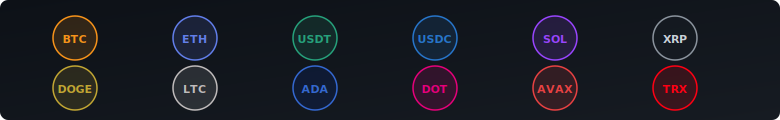

<p align="center">
  
</p>

<p align="center">
  
  
  
  
  <a href="https://github.com/darshjme/mycryptocoin/stargazers"></a>
</p>

---

## What This Is

A payment gateway for cryptocurrency. Merchants integrate one API, accept 12 coins, and get automatic payouts at a flat 0.5% fee. Accept crypto. Get paid.

---

## Supported Coins

<p align="center">
  
</p>

All transactions at a **flat 0.5% fee**. No monthly subscriptions, no hidden charges.

---

## Payment Flow


Real-time WebSocket events fire at every stage.

---

## Features

| Category | What You Get |
|----------|-------------|
| **Payments** | Multi-chain processing, real-time exchange rates, QR codes, checkout sessions, discount codes, invoices |
| **Dashboard** | Transaction history, balances, withdrawal management, API keys, webhook config, analytics |
| **Admin Panel** | Merchant oversight, system analytics, transaction monitoring, fee management |
| **Checkout SDK** | Embeddable widget, hosted checkout pages, white-label support |
| **WordPress** | WooCommerce gateway, automatic order status sync, zero-code setup |
| **Real-Time** | WebSocket (Socket.IO) for payment confirmations, status updates, live feeds |
| **Payouts** | Automated withdrawals, configurable schedules, multi-currency settlement |
| **Notifications** | Email via Nodemailer, WhatsApp alerts via Baileys |
| **API** | REST with OpenAPI 3.0, rate limiting, Zod validation, comprehensive error handling |

---

## Monorepo Structure

```
mycryptocoin/
├── backend/                 Node.js + Express + TypeScript API          :4000
├── dashboard/               Next.js 14 merchant dashboard               :3000
├── admin/                   Next.js 14 admin panel                      :3001
├── website/                 Next.js 14 marketing site                   :3002
├── docs-site/               Next.js documentation site
├── shared/                  Shared TypeScript types & constants
├── wordpress-plugin/        WooCommerce payment gateway (PHP)
├── docs/
│   ├── api/                 Endpoint docs + OpenAPI spec
│   └── guides/              Integration, SDK, WordPress, Shopify
├── nginx/                   Reverse proxy & SSL termination
├── scripts/                 Deployment & server setup
├── marketing/               Brand assets, pitch deck, emails
├── docker-compose.yml       Development environment
└── docker-compose.prod.yml  Production (3 replicas, PG replication, SSL)
```

---

## Quick Start

```bash
git clone https://github.com/darshjme/mycryptocoin.git
cd mycryptocoin

# Configure
cp .env.example .env.production

# Deploy full stack
docker compose -f docker-compose.prod.yml up -d

# Run migrations
docker compose -f docker-compose.prod.yml exec backend npx prisma migrate deploy
```

Production stack: 3 backend replicas with rolling updates, PostgreSQL primary + replica with WAL streaming, Redis with AOF persistence, Nginx with Let's Encrypt SSL.

### Manual Setup

```bash
git clone https://github.com/darshjme/mycryptocoin.git
cd mycryptocoin

docker compose up -d          # PostgreSQL + Redis
npm install                   # all workspaces
npm run db:generate           # Prisma client
npm run db:migrate            # run migrations
npm run db:seed               # sample data (optional)

# Start services
npm run dev:backend           # API on :4000
npm run dev:dashboard         # Dashboard on :3000
npm run dev:admin             # Admin on :3001
npm run dev:website           # Marketing on :3002
```

---

## API Reference

Full docs in [`docs/`](./docs) with an [OpenAPI 3.0 spec](./docs/openapi.yaml).

| Method | Endpoint | Description |
|--------|----------|-------------|
| `POST` | `/api/v1/payments` | Create a payment |
| `GET` | `/api/v1/payments/:id` | Get payment status |
| `POST` | `/api/v1/checkout/sessions` | Create checkout session |
| `POST` | `/api/v1/webhooks` | Configure webhooks |
| `POST` | `/api/v1/withdrawals` | Request withdrawal |
| `GET` | `/api/v1/wallets` | List merchant wallets |
| `GET` | `/api/v1/exchange-rates` | Current rates |
| `POST` | `/api/v1/invoices` | Create invoice |
| `POST` | `/api/v1/refunds` | Issue refund |
| `POST` | `/api/v1/discount-codes` | Create discount code |

<details>
<summary><strong>Create a Payment</strong></summary>

```bash
curl -X POST https://mycrypto.co.in/api/v1/payments \
  -H "X-API-Key: your_api_key" \
  -H "Content-Type: application/json" \
  -d '{
    "amount": "100.00",
    "currency": "USDT",
    "description": "Order #1234"
  }'
```
</details>

<details>
<summary><strong>Create a Checkout Session</strong></summary>

```bash
curl -X POST https://mycrypto.co.in/api/v1/checkout/sessions \
  -H "X-API-Key: your_api_key" \
  -H "Content-Type: application/json" \
  -d '{
    "amount": "49.99",
    "currency": "ETH",
    "success_url": "https://yoursite.com/success",
    "cancel_url": "https://yoursite.com/cancel"
  }'
```
</details>

<details>
<summary><strong>Check Payment Status</strong></summary>

```bash
curl https://mycrypto.co.in/api/v1/payments/pay_abc123 \
  -H "X-API-Key: your_api_key"
```
</details>

<details>
<summary><strong>WebSocket Events</strong></summary>

```javascript
import { io } from "socket.io-client";

const socket = io("wss://mycrypto.co.in", {
  auth: { apiKey: "your_api_key" }
});

socket.on("payment:confirmed", (data) => {
  console.log("Payment confirmed:", data.paymentId);
});

socket.on("payment:failed", (data) => {
  console.log("Payment failed:", data.reason);
});
```
</details>

All requests require a merchant API key in the `X-API-Key` header.

---

## Security

Passed a 13-category penetration test. Here is what is covered:

| Category | Mitigation |
|----------|------------|
| SSRF | Strict URL validation, outbound request allowlisting |
| Timing Attacks | Constant-time comparison for keys, tokens, signatures |
| Webhook Auth | HMAC-SHA256 signature verification on all inbound webhooks |
| WebSocket Auth | Token-based connection auth with per-event permission checks |
| Race Conditions | Redis distributed locking on payment state transitions |
| Double-Credit | Idempotency keys + atomic database transactions |
| Double-Refund | State machine enforcement with pessimistic locking |
| Prisma Leak | Singleton pattern, connection pooling, graceful shutdown |
| Rate Limiting | Tiered per-endpoint limits, Redis-backed sliding windows |
| Input Validation | Zod schemas on every request, strict type coercion |
| Headers / CORS | Helmet security headers, configurable CORS policies |
| Container | Non-root `appuser` (UID 1001) in production |
| Secrets | Environment-based config, nothing hardcoded in code or images |

---

## WordPress / WooCommerce

Native WooCommerce payment gateway. Zero-code integration.

```
wordpress-plugin/
└── mycryptocoin-gateway/
    ├── mycryptocoin-gateway.php    Main plugin file
    ├── includes/                   Gateway class, API client
    ├── templates/                  Checkout & thank-you pages
    ├── assets/                     Frontend assets
    └── languages/                  i18n translations
```

Upload `mycryptocoin-gateway` to `wp-content/plugins/`, configure your API key under WooCommerce > Settings > Payments. Full guide: [WordPress Setup](./docs/guides/wordpress-setup.md).

---

## Tech Stack

<p>
  
  
  
  
  
  
  
  
  
  
  
  
  
  
</p>

---

## Contributing

1. Fork the repository
2. Create your feature branch: `git checkout -b feature/my-feature`
3. Install dependencies: `npm install`
4. Start dev environment: `docker compose up -d && npm run dev:backend`
5. Commit your changes: `git commit -m 'feat: add my feature'`
6. Push to the branch: `git push origin feature/my-feature`
7. Open a Pull Request

Bug reports and feature requests welcome via [GitHub Issues](https://github.com/darshjme/mycryptocoin/issues).

---

## License

MIT License. See [LICENSE](./LICENSE) for details.

---

<p align="center">
  <a href="https://darshj.me">darshj.me</a>
</p>
